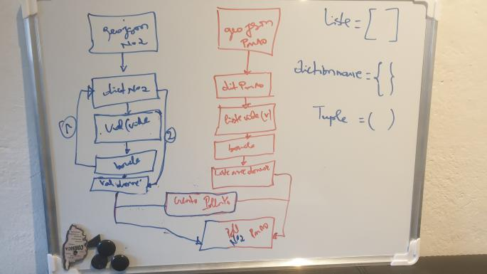
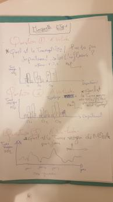
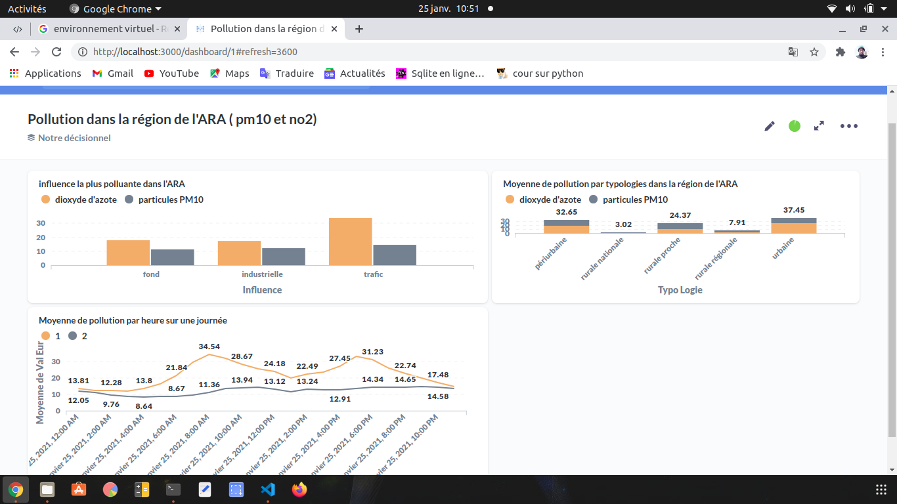
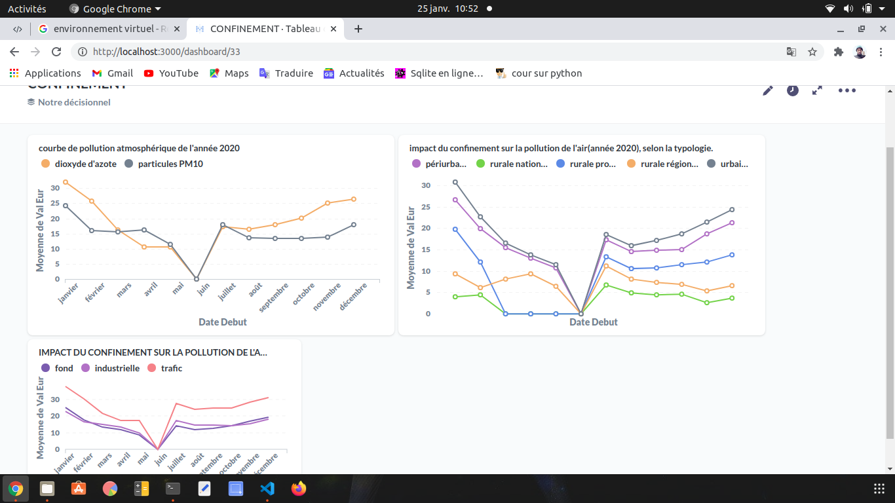

```
François Okolo
```
# Projet 2

***********************************
## Partie I : Contexte du projet

Le 10 juillet 2020, le Conseil d'Etat a rendu publique une décision historique pour contraindre l'Etat Français à prendre des mesures immédiates en faveur de la qualité de l'air. Les seuils fixés par l'Europe pour les particules PM10 et le dioxyde d'azote NO2 doivent être respectés sous peine de lourdes amendes.
En Auvergne-Rhône-Alpes, différentes zones sont concernées par ces dépassements. La région a donc besoin de différents outils pour suivre et analyser la pollution atmosphérique à l'échelle de la région.
Suite à des réunions, trois besoins ont été retenus :

1 - La direction de la région en charge de la pollution de l'air souhaite avoir un tableau de bord avec différents indicateurs globaux (échelle de la région) concernant la qualité de l'air. Pour avoir une vision plus détaillée, elle souhaite aussi avoir une cartographie de la région avec les différents polluants atmosphériques mise à jour toutes les heures.

2 - Avec la même source de données que pour le besoin précédent, le service de datascience de la région souhaite avoir un notebook Jupyter pour pouvoir faire travailler ses équipes de datascience. Elle a besoin que le notebook contienne toutes les explications pour faire des requêtes sur la base de données ainsi qu'une cartographie. Le but est que les data scientists soient très vite opérationnels sur les données.

3 - Suite à la pandémie de COVID-19 qui a débuté au début de l'année 2020, la région souhaite connaître l'impact du confinement sur la pollution atmosphérique dans la région.

Dans la région, différentes stations de mesures de la pollution de l'air sont implantées. Les données sont accessibles grâce à une API à l'adresse suivante : https://data-atmoaura.opendata.arcgis.com/
## Partie II :
###         A   - Axes de reflexions pour les demandes clients 

 ####        1 - Axes de reflexion pour la première question

 * Dans notre exercice nous devons premièrement trouver les API nécessaires pour la collecte des données
  
 * A laide des librairies requests, json dans python nous allons collecter les données, les garder dans deux dictionnaires differents et enfin les inserrer dans un même tableau pour en faire notre table de données brutes (pollution)


<figure>
    
    <figcaption>workflow de nos données pour obtenir une table avec les données brutes</figcaption>
</figure>


 * Après avoir créé notre table avec les données brutes nous allons créer notre base de données postgresql (lirairie psycopg2) et les intégrer à metabase pour essayer de repondre à quelques questions telque:
    - l'influence la plus polluante dans la region Auvergnes-Rhônes-Alpes(ARA) ?
    - la moyenne de pollution par heure dans la région ?
    - Moyenne de pollution dans la région par typologie ?

<figure>
    
    <figcaption>maquette des trois grapphiques</figcaption>
</figure>

 une fois que nous avons notre table pollution avec les données brutes, nos pouvons  la disloquer et construire notre modèle entité-association  constitué de dautre tables; Ceci pour optimiser notre travail.

 <figure>
    
    <figcaption>modèle de notre base de données et ses tables relationnelles</figcaption>
</figure>


#### 2 - Axes de reflexion pour la deuxième question


  Ensuite  nous allons créer un fichier jupyter notebook (fichier.ipynb) pour léquipe de datascience : notre travail va se limiter à leur expliquer comment est construite notre base de donnée et les commandes pour l'exploiter.


#### 3 - Axes de reflexion pour la troisième question

Pour répondre à la question de l'impact du confinement  sur la pollution, nous aurons besoins de nouvelles données, de préference des données sur un an glissant. On utilisera le même workflow que nos données précedentes


<figure>
    
    <figcaption>Workflow des données</figcaption>
</figure>

 
 Apres avoir integrer les donnnées dans metabase, on va les visualiser et les valoriser en repondant a quelues questions telques :

 * Quels sont les variations des taux de polluants sur l'année globale (2020)?
  
 * Quel l'impact de confinement sur la pollution de l'air par typologie ?

 * Quel est l'impact de l'influence sur la pollution de l'air pendant la periode du confinement ? 


###         B   - Captures d'écran des Tableaux de bord 


    1 - La direction de la région en charge de la pollution de l'air souhaite avoir un tableau de bord avec différents indicateurs globaux...


<figure>
    
    <figcaption>Pollution dans l'ARA (métique horaire) depuis debut 2021</figcaption>
</figure>


    2 - ...le service de datascience de la région souhaite avoir un notebook Jupyter pour pouvoir faire travailler ses équipes de datascience...

**_cf depôt gitlab_**


    3 - Suite à la pandémie de COVID-19 qui a débuté au début de l'année 2020, la région souhaite connaître l'impact du confinement...


<figure>
    
    <figcaption>Impact du confinement sur la pollution atmosphérique (année 2020)</figcaption>
</figure>


_cf gitlab pour le script python et le fichier jupyter notebook_


**Gestion de projet :**
* *[Trello](https://trello.com/devdatasimplon/home)*
* *[Discord](https://discord.com/)*
* *[Gitlab](gitlab.com)*
* *[Excalidraw](https://excalidraw.com/)*

**Documentation :**

* *Cours Simplon*
* *[SQL Cours et exercices](https://fxjollois.github.io/cours-sql/)*
* *[Analyse de données massives](https://fxjollois.github.io/cours-2019-2020/m1--add-massives/)*
* *[Cours python](https://python.doctor/page-apprendre-variables-debutant-python)*
* *[Folium](https://python-visualization.github.io/folium/)*

Lien vers les slide google :
https://docs.google.com/presentation/d/1LCJvNfju6AiGc1ZRivWzhXYDsSk8KPPCa5DE_VK_zgc/edit#slide=id.p
>>>>>>> 2d21695aed7623269302623bf4ce365b5740387e
